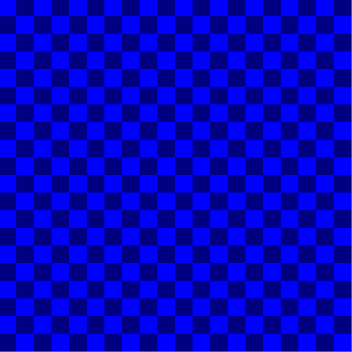

# DT228/DT282 Object Oriented Programming 2017-2018

Resources
---------
* [Webcourses](http://dit.ie/webcourses) - Course code: CMPU2016
* [Processing](http://processing.org)
* [The Processing language reference](http://processing.org/reference/)
* [Learning Processing: A Beginner's Guide to Programming Images, Animation, and Interaction (Morgan Kaufmann Series in Computer Graphics)](http://http://www.learningprocessing.com/)
* [The Nature of Code](http://natureofcode.com/)
* [Eclipse](http://eclipse.org)
* [The git manual - read the first three chapters](http://git-scm.com/documentation)
* [A video tutorial all about git/github](https://www.youtube.com/watch?v=p_PGUltnB6w)
* [The Java Tutorial from Oracle](http://docs.oracle.com/javase/tutorial/)
* [Games Fleadh](http://www.gamesfleadh.ie/)
* [The Imagine Cup](https://www.imaginecup.com/)

## Contact the lecturer
* Email: bryan.duggan@dit.ie
* Twitter: [@skooter500](http://twitter.com/skooter500)

Some assignments from previous years:

[](https://www.youtube.com/watch?v=IJ4TzwCRns8)

[](https://www.youtube.com/watch?v=tqGtfsXNPng)

[](https://www.youtube.com/watch?v=uykz5mCjV0w)

# Assessments

- [Assignments](assignments.md)

- 14 November 2017 Lab Test 10%
- 12 December 2017 Assignment 1 submission 15%
- 30 January 2018  Lab Test 2 - 10%
- Assignment 3 - 15%
- End of Year MCQ - 50%

# Week 5 - Conway's Game of Life

- Stephen Hawkings on the Game of Life:

  [](https://www.youtube.com/watch?v=CgOcEZinQ2I)

- John Conway on the Game of Life:

  [](https://www.youtube.com/watch?v=C2vgICfQawE)

- Epic Conway's Game of Life:

  [](https://www.youtube.com/watch?v=FdMzngWchDk)

- And finally, Alan Watts

  [](https://www.youtube.com/watch?v=wU0PYcCsL6o)

- [Conway's Game of Life on Wikipedia](https://en.wikipedia.org/wiki/Conway%27s_Game_of_Life)
- [The Game of Life Wiki](http://www.conwaylife.com/wiki/Main_Page)

## Lab
### Learning Outcomes
- Complete the game of life code
- Practice iterating over a 2D array
- Discover the amazing power of cellular automata

Try and complete the Game of Life we started in the class today. Here is the [code from the class]().  you weren't in the class, you could take a read of the Game of Life wiki page and have a crack at implementing it from scratch yourselves. It's not too difficult. If you get your basic game of life to evolve, you could try these additions:

- The method ```void mousePressed()``` gets called in your sketch whenever the mouse is pressed. The method ```mouseDragged``` gets called whenever you hold the mouse down and move it over your sketch. You can get the mouse x and y coordinates by using the built in variables ```mouseX``` and ```mouseY```. You can use these methods to implement mouse drawing. To do this you need to calculate which row and column in the 2D array the mouse is over and then set this cell to be true.

- When you press the space key, the game should pause and unmpause, in other words, not update the game board while the game is paused
- When you press the c key, the board should clear. In otherwords, you should set every element in th 2D array to be false.
- When you press the r key, you should randomly set 50% of the elements to be true. To do this, you need to iterate through the array and generate a random number between 0.0f and 1.0f. If the number is > 0.5f, you set the element to be true otherwise set it to be false.

There some interesting starting patterns you can program also. You could write code so that when you press a number key it creates the starting pattern at the mouse x and y. I used the mouse x and y to be the top left of the shape.

| Pattern | Description |
|---------|-------------|
| | Gosper Gun |
| | Lightweight spaceship |
| | Tumbler |
| | Glider |
| | I'm not sure what this is called, but it makes amazing patterns |

# Week 5 - More on Classes & ArrayList's
- [Partial solution to the lab test from last year](processing/StarMap1). This has an example of using a class, an ArrayList and it draws the grid.
- [Our implementation of the Processing map function](processing/map)

## Videos 
[](https://www.youtube.com/watch?v=nicMAoW6u1g)

# Lab
## Learnning outcomes
- Make classes
- Use an ArrayList
- Use the Processing map function
- Get familiar with loading a CSV dataset
- Get practice for the lab test

### Part 1  
Today, try to finish off the last part of [last years lab test](https://github.com/skooter500/OOP-LabTest1-2016), which is being able to click on stars and calculate the distance in parsecs between the two stars. 

### Part 2

- Have a go at completing the [lab test from 2014](https://github.com/skooter500/OOP-2016-2017/blob/master/processing/ExpensesProcessing/Lab%20Test%201.docx?raw=true). It's not as much fun, but you can get the chance to practice a lot of the concepts we have learned in the class in the past couple of weeks:
	- Making a class with constructors
	- Loading a dataset
	- Using an ArrayList
	- Iterating over an ArrayList
	- Visualising a dataset
	- Using the map function
- Here is a link to [the dataset you need](https://raw.githubusercontent.com/skooter500/DT228-OOP/master/Processing%20Examples/Expenses/data/expenses.txt)

# Week 4 - Classes & ArrayList's
- [Last years lab test](https://github.com/skooter500/OOP-LabTest1-2016)
- [Download the star dataset](https://raw.githubusercontent.com/skooter500/OOP-LabTest1-2016/master/HabHYG15ly.csv)
- [loadTable refererence](https://processing.org/reference/loadTable_.html)
- [map reference](https://processing.org/reference/map_.html)
- [Classes in Processing](https://processing.org/reference/class.html)
- [ArrayList reference](https://processing.org/reference/ArrayList.html)

## Lab
## Learning outcomes
- Make classes
- Use an ArrayList
- Use the Processing map function
- Get familiar with loading a CSV dataset
- Get practice for the lab test

[Here is the code that we wrote in the class today](processing/StarMap1). It has:
- A star class with multiple constructors
- loadTable to load a csv file of data
- An ArrayList of Star objects

[See how far you get in completing last years lab test](https://github.com/skooter500/OOP-LabTest1-2016).
Don't be tempted to look at the solution straight away, try and code a solution yourself.

# Week 3 - Loops & Arrays



- [Loops example](processing/loops)
- [Arrays examples](processing/arrays)

## Lab 
### Learning outcomes
- Practice iterating over arrays in Java
- Practice in using the for loop and variables to generate sequences of numbers
- Understand how a line graph is made
- Practice constructing alogorithms as part of a system
- Practice presenting data visually

Here is [some starter code with examples of arrays](processing/arrays)

Here is what you can try and make today:


These are the steps I suggest you follow:

- Figure out how to draw a trend line graph first
- Then figure out how to leave horizontal and vertical borders around the graph. I would suggest making a variable called border to control this.
- Then figure out how to scale it so that it scales the data when drawing to the range 0-150. You could make this a variable
- Then figure out how to draw the horizontal axis. This will be a for loop obviously. You might find the following Java/Processing methods useful:
  - [The Processing map method](https://processing.org/reference/map_.html)
  - [text](https://processing.org/reference/text_.html) - Prints text to the screen at x and y coordinates
  - [textAlign](https://processing.org/reference/textAlign_.html)
  - [substring](http://www.tutorialspoint.com/java/java_string_substring.htm)
- Finally figure out how to draw the vertical axis. Another loop! This is the trickiest part I think

Try and parameterise as much of your sketch with variables, so that you could reuse the code to graph other types of data.
For example, I found it useful to write a method:

```Java
void drawAxis(float[] data, String[] horizLabels, int verticalIntervals, int maxVertical, float border)
```

to draw the horizontal and vertical axes. You might like to write seperate methods for the horizontal and vertical axis.
This took me about an hour to complete today, so it's tricky enough to get everything working, but worth it!

- [Solution](processing/data)

### Advanced!

Try and draw this pie chart:


You can use the Processing arc method to do this!

- [Solution](processing/data)

## Tutorial

[](https://www.youtube.com/watch?v=WXftKFCtPrQ)

There is a bug running Processing through Java 9, so you have to run Processing with Java 8 instead
To change the version of Java to Java 8 on the Mac:

```bash
export JAVA_HOME=`/usr/libexec/java_home -v 1.8`

```

```Java
package ie.dit;
import processing.core.PApplet;

public class AudioViz extends PApplet {

	public void setup()
    {
    }

    public void settings()
    {
        size(500, 500);
    }

    public void draw()
    {
    	background(0);
    	stroke(255);
    	line(100, 100, 200, 200);
    }

    public static void main(String[] args)
    {
        String[] a = {"MAIN"};
        PApplet.runSketch( a, new AudioViz());
    }
}
```

This is how to compile and run a Processing Java program on Mac:

```bash
javac -classpath /Applications/Processing.app/Contents/Java/core.jar ie/dit/*.java
java -classpath /Applications/Processing.app/Contents/Java/core.jar:. ie.dit.ProcessingTest
```
# Week 2 - Variables & conditions
- [Variables example](processing/variables)
- [The amanita sketch (the mushroom that moves with the mouse)](processing/amanita)


## Videos
[](https://www.youtube.com/watch?v=B-ycSR3ntik)

[](https://www.youtube.com/watch?v=rZ36BzXFT6Q)

[](https://www.youtube.com/watch?v=wsI6N9hfW7E)

[](https://www.youtube.com/watch?v=mVq7Ms01RjA)

## Lab 

## Learning Outcomes
- Use what you learned in class to build a complete game system in Processing
- Practice drawing stuff and working out relative co-ordinates
- Practice using variables and compound if statements
- Gain experience thinking computationally
- Learn how to use random numbers
- Learn how to get input from the keyboard
- Learn how to import libraries into Processing

This is a video of a game called Bugzap that you can try and make in Processing today. There is a fair bit to it, so don't worry if you don't manage to complete everything.

[](https://www.youtube.com/watch?v=s6PA8jtWneQ)

How you should do it:
- Get the main game working first and then if you have time, add fonts, sound, the splash screen and the game over screen.
- Write some code to draw the bug. You can write a method to do this if you like (but it's not essential). Here is [an article on using methods in processing](https://processing.org/examples/functions.html). Also make global variables for the bug position and size.
- Get the bug moving. The bug moves a random amount either to the left or the right and it also moves down the screen. Use the random method in Processing to generate random numbers. Also the bug can't move off the screen. You can use the % operator to make something happen on an interval. For example:

  ```Java
  if (frameCount % 60 == 0)
  {
    // Code in here will happen once per second
  }
  ```
- Write some code to draw the player. Use variables to control the player position and size. A method is good here too!
- Write code to move the player in response to a key presses. This is one way to do keyboard handling in Processing:

```Java
if (keyPressed)
{
  if (keyCode == LEFT)
  {
    // This will happen if the left key is pressed
  }
}
```
- Now add the player lazer. I used to UP key for this. I just drew a line for the lazer.
- Make a variable for score and check for collisions between the lazer and the bug. Add a variable for score. You can print stuff to the screen using the text method in Processing. In my version, I actually used [this processing library](http://www.foobarquarium.de/blog/processing/MovingLetters/) which makes wireframe text.
- Make some sound effects and add them to the game. I used [BFXR](http://www.bfxr.net/) to make the sounds and the Minim library to play them, but you might prefer to use the [built-in audio methods in Processing](https://processing.org/tutorials/sound/).
- Add the splash screen and game over screen

- [Solution](http://github.com/skooter500/BugZap)

## Tutorial
- Clone the repository for the course by typing:
    ```bash
    git clone https://github.com/skooter500/OOP-2017-2018
    ```
- If you already have the course cloned, you can pull the latest changes by cd'ing to the folder where you cloned the course and typing:
	```bash
	git pull
	```
- Open the rick_n_morty.pde sketch. This sketch loads the background image and sound. Complete the sketch so that it does this:

[](https://www.youtube.com/watch?v=BR1p2Dl6ELE)
	
# Week 1 - Introduction to Processing and the course

## Lecture
* [Introduction slides](https://1drv.ms/p/s!Ak7y2552PWCrhONjAgskv4PATGqdpw)
* [The contract for this course](https://1drv.ms/w/s!Ak7y2552PWCrjPYXt8HlWl1T1cg5Og)

## Lab

### Learning Outcomes
- Enroll on Webcourses
- Become familiar with the syntax of Processing
- Become familiar with writing and running sketches in Processing
- Clone a git repository!
- Install Processing libraries

### Part 1 - Drawing
- Log onto Webcourses and enroll on the module CMPU2016.
- Check out [the Processing reference](https://processing.org/reference/)
- Check out [Daniel Shiffman's awesome YouTube channel](https://www.youtube.com/user/shiffman)
- Check out [these Sci-Fi user interfaces made by last years OOP students](https://www.youtube.com/playlist?list=PL1n0B6z4e_E5RZYrubD2pcxq0qzGy-3vr)
- Check out [these music visualisers made in Processing by last years game programming students](https://www.youtube.com/watch?v=cW8s5i9dmqA&list=PL1n0B6z4e_E6jErrS0ScSCaVrN7KV729x)
- If you are curious, check out [some of my creature videos](https://www.youtube.com/watch?v=cW8s5i9dmqA&list=PL1n0B6z4e_E6jErrS0ScSCaVrN7KV729x)

- Look up the following methods in the [Processing language reference](http://processing.org/reference/ ) to make sure you are clear about the syntax and parameters:

    * noStroke
    * noFill
    * line
    * ellipse
    * rect
    * background
    * stroke
    * fill
    * size
    * arc
    * triangle

Write a processing sketch to draw the following shapes:


I prefer to draw the shapes on paper first before I try and work out the coordinates. Try experimenting with different colours! 

### Part 1 - Cloning git repositories

Clone the course website:

- [Install git](https://www.atlassian.com/git/tutorials/install-git) if you need to. It should be installed on the lab computers already
- Start git bash
- Type ```pwd``` to print the current working directory
- Type ```cd ˜``` to cd to your home directory
- Type ```cd Documents``` Also you can start typing the path and then press TAB and bash will autocomplete the command
- You can use the command mkdir to make a directory if you want to make a subdirectory
- Type ```git clone https://github.com/skooter500/OOP-2017-2018``` to clone the course website
- Now navigate to the OOP-2017-2018 folder in windows explorer and have a look at the files that were cloned

Clone NILL, a game I programmed in Processing and get it running:

- Type ```git clone https://github.com/skooter500/NILL``` This will clone the repository
- Find the NILL folder that was created and double click on the file NILL.pde. It should open in Processing
- You need to install the Minim library and the Game control libraries to make NILL work. Go to Sketch | IMport Library | Add library to do this
- See if you can collect all the pods
- Have a look through the source code for NILL and see if you can figure out the following
    - What are the Java datatypes?
    - What classes are in the project?
    - How is the landscape drawn?
    - How does the game keep track of all the objects on screen?

## Tutorial

Clone the repository for NILL and get the game working as described above. Create a new branch by typing:

```git checkout -b tutorial```

Now make the following changes to the game:

- Change the colour of the Ship
- Change the movement speed of the ship
- Change how fast the ship rotates
- Change the force of gravity on the ship
- Increase the amount of fuel the ship starts with
- Make the powerups spawn twice as fast
- Make the game spawn fuel twice as frequently as asteroids
- Change the bumpiness of the terrain
- Add more pods
- Draw the fuel pods as octogons instead of pentagons
- Increase the number of stars in the background
- Change the keys used to control the ship to be A, D and W instead of left, right and up
- Disable collisions between the ship and the terrain

Commit your changes to the new branch by typing:

```bash
git add . -- all
git commit -m "tutorial changes"
```
