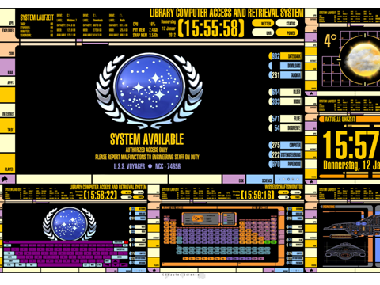
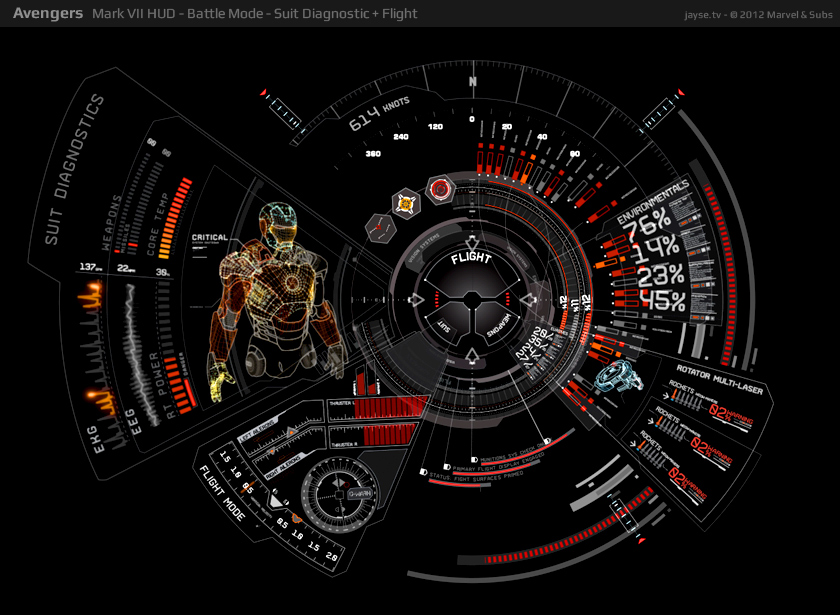
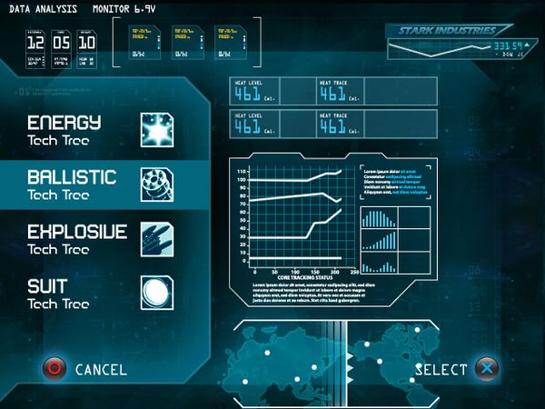

# Object Oriented Programming Assignments

## Assignment 2

This is your opportunity to really impress me by bringing together all the stuff you have learned this year into one final OOP assignment. You can make anything you like and you can work on a team of up to five people. You can also work alone if you prefer. Games Fleadh/Imagine Cup projects are all encouraged or indeed any other competitions. You can use any OOP language that you like (there are some constraints listed below) and I expect you to have to do self-directed learning on this project.    

Rules:
- You must use git to manage the source code on your project 
- If you are on a team I expect to see git commits for each team member
- You can use Processing, but this must be through Eclipse not the Processing IDE
- You can use Unity3D, however if you decide to use Unity3D then you project should be mostly code, so consider using algorithms to procedurally generate content 

Some ideas:
- A music sequencer
- A music visualiser
- A music search engine
- A fractal visualiser
- An artificial life simulation
- Steering behaviours (check out [this amazing free book for ideas](http://natureofcode.com/book/))
- A robot controller, maybe using Lego Mindstorms/Arduino/Raspberry PI
- A solar system simulator
- A drawing program
- A chat bot
- Something using the Kinect or Leap Motion
- A classifier
- Something that analyses a dataset and draws some cool graphs 
- A neural network that learns to recognise pictures
- 3D Conways Game of Life
- A game!
- An app

Marking Scheme:

Complexity:30% Polish: 20% Learning 20% Project management: 10% Jazz 20% 

| Grade | Description |
| ------|-------------|
| First | A project that looks great and is very polished. All the assets in the project are self made and all the code is self written. There a significant amount of complexity. The assignment has lots of functionality and is technically deep, with complex algorithms you had to develop. The code is organised into classes that use inheritance, polymorphism, abstract classes and interfaces appropriately. There is a lot of novelty and originality. A significant amount of learning and research outside the class is evident. You have entered a competition, published your assignment on an app store or otherwise disseminated your work outside the course. You will have used git extensively. Everything works. Your team held regular project meetings and each team member contributed equally to the project. Examples: A prize winning games fleadh game. A web project with lots of functionality, deployed to the cloud. A complex app submitted to Google play or the app store with lots of downloads and a back end. An IOT project such as a robot with a significant amount of Python code. Evidence of work throughout the semester |
| 2.1 | The project looks good. You put in a good effort. Some features may not be complete or entirely working or the assignment is not too complex. Mostly based on stuff you learned in class or tutorials. Examples: A more simple Unity game based on tutorials with self created assets and some C# - a simple shooter or tower defence game. A Java/Swing app. A simple Android app with a few screens and a database. A processing/Eclipse shooter game. Evidence of work done in the month before submission |
| 2.2 | The project looks so so, but is pretty basic. There might be significant issues that your team couldn't resolve. Not much use evidence of learning outside the class. There is not much code, maybe a page or two. Examples: A basic Android app like a calculator or a very simple Unity game based on Unity Tutorials. A simple Python web app. Evidence of about a weeks work |
| Pass | All code in one file. Around a hundred lines of code. Looks like it could have been completed in < 1 day. Little or no functionality. Lots of code acquired from other sources or mostly code we used in the class. About a days work |
| Fail | Something very basic that looks like it could have been completed in an hour. The assignment has no interactivity. Significant unaddressed technical problems. No git usage.  |

## Assignment 1 - Due Week 13

Use Processing to create a UI for a sci-fi movie device like a warp drive, engines, weapons system. You can base it on any movie you like or come up with your own. It should be kinda usable. It should have lots of animation & interactivity and look amazing. It can be as far out as you like. In other words it can be for an alien. You sould use all the stuff you are learning on the course:

- Variables, loops, methods
- Arrays & array lists
- Objects, inheritance, polymorphism
- The unit circle and trigonometry
- pushMatrix, popMatrix, translate and rotate

You can take inspiration from sci-fi movies that you like, such as these ones:

Also! You should include a readme.md file and embed a youtube video demo of your assignment in the readme file.

Marking Scheme:

Complexity: 25% UI:25% Jazz: 20% Use of git: 20% Documentation: 10%

| Grade | Description |
| ------|-------------|
| First | A project that looks impressive. All the graphics are 100% procedural and look beautiful. There a significant amount of clever animation or interactivity. You will have made classes for UI elements such as buttons. You may also have used polymorphism, abstract classes and interfaces where appropriate. You will have used PVectors, transforms and classes to create autonomous elements in the assignment. There is a lot of novelty and originality and the UI you made looks like it could be used in a movie. You will be loading content from text files. You will have used advanced features of Processing that we didn't cover in the class. You will have used git extensively. Everything works. > 50 git commits|
| 2.1 | The project looks good. There is a some animation and interactivity, but not too complicated. You put in a good effort. Some features may not be complete or entirely working. Probably no file IO, but there should be while loops, for loops if statements etc to control aspects of the assignment. You have used classes, but possibly not inheritance and polymorphism. 20-40 git commits |
| 2.2 | The project looks so so, but is pretty basic. There should be some animation but significant issues that you couldn't resolve. You may have used sprites instead of drawing everything. All the movement and animation code will be pretty basic for example colours changing each frame or movement controlled by variables that just update each frame. Little or no control code. There is not much code, maybe a page or two. Mostly based on the example code. Between 10 and 20 commits |
| Pass | All code in one file. Around a hundred lines of code. Looks like it could have been completed in an hour or two. Mostly drawing code, little or no controling code. Little or no functionality. Lots of code acquired from other sources. < 10 commits |
| Fail | Something very basic that looks like it could have been completed in an hour. Just drawing code, no control code. The assignment has no interactivity. Significant unaddressed technical problems. No git usage.  |

Rules!

- As much as possible this project should be 100% your own code. You will not get any marks for any code that include that you get from books or from the internet. This assignment is about testing what *you* have learned and what *you* can do.
- There will be a feedback session after the assignment where you will have the opportunity to get individual feedback on your submissiona and have your mark explained to you.
- All assignment submissions must be demoed in the lab that week.
- If you need to submit an assignment late, you must submit a PC/1 form to the exams office.
